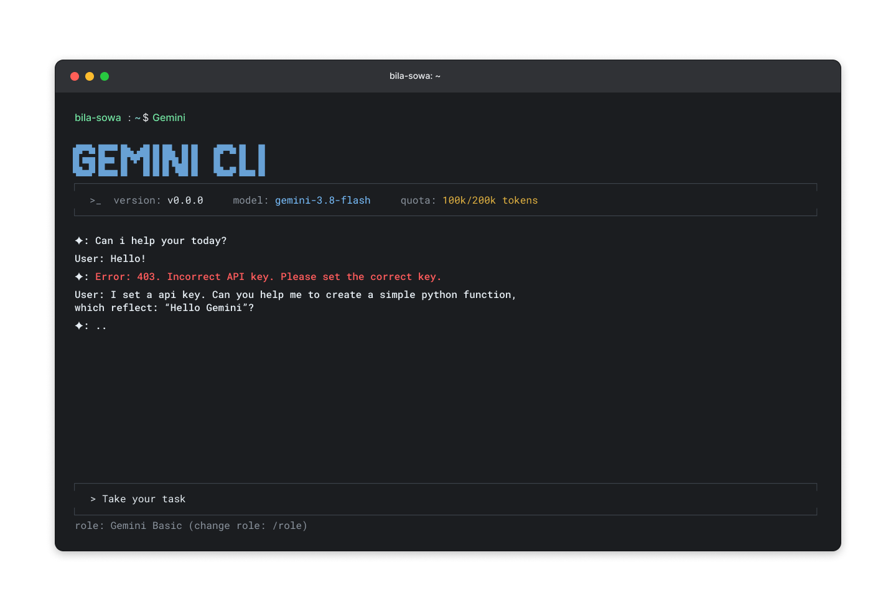
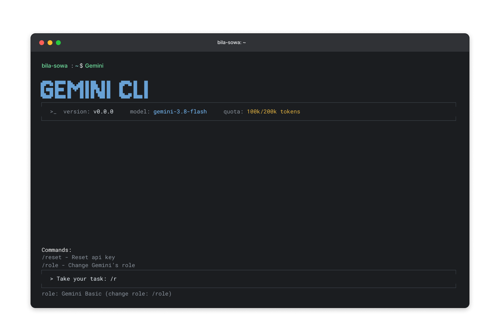
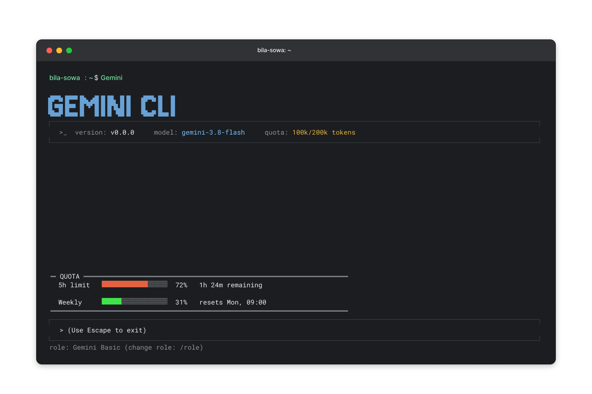
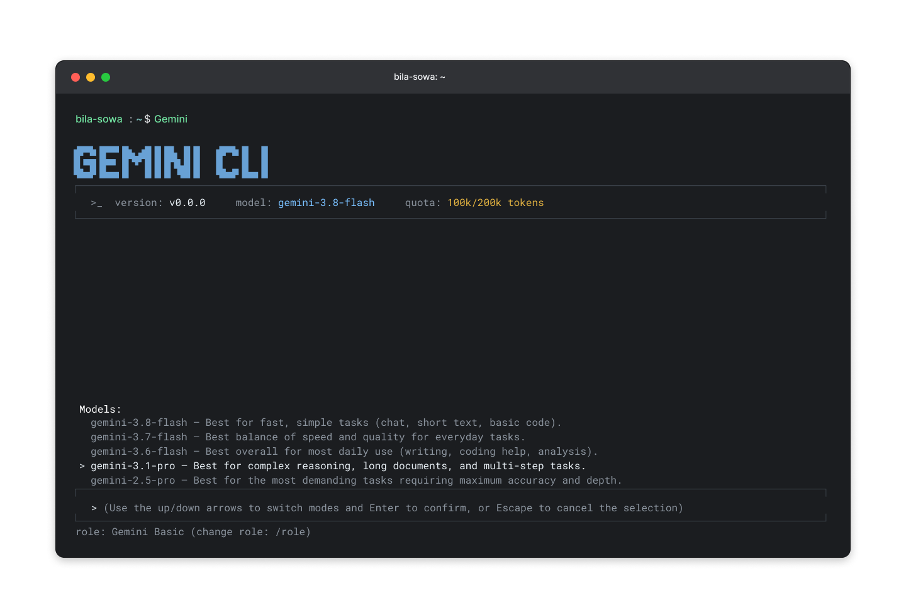
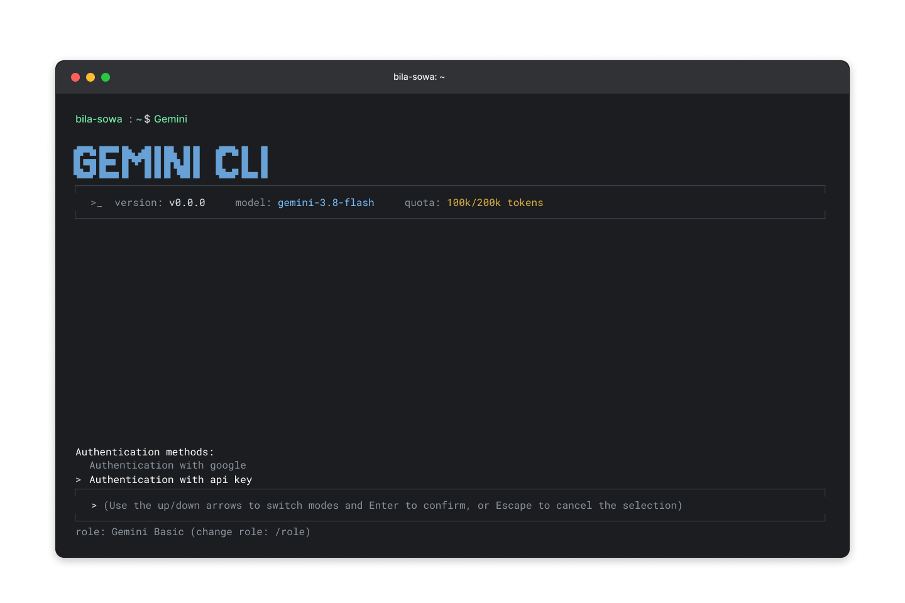
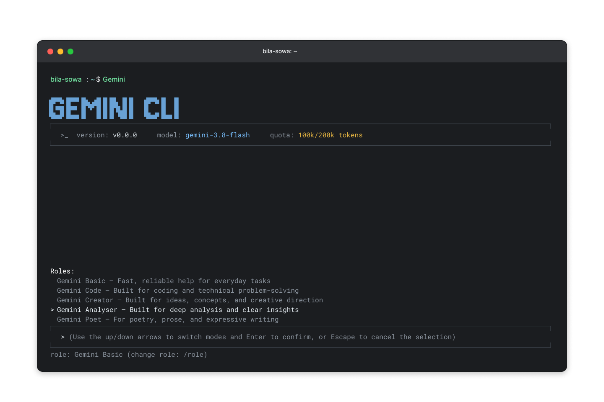

  

  <h1>Gemini CLI</h1>

  
<strong>A Gemini-first command-line agent for everyday work.</strong>

  

    <a href="#about">About</a> ·
    <a href="#demo">Demo</a> ·
    <a href="#features">Features</a> ·
    <a href="./documentation/core/architecture.md">Architecture</a> ·
    <a href="#license">License</a>
  

> [!NOTE]
> **Project status:** Gemini CLI is currently in the design and prototyping
> stage. The screenshots below are interface concepts, and the feature list
> describes the intended product scope. A runnable package has not been
> released yet.

## About

Gemini CLI is an early-stage, Gemini-powered command-line agent designed to be
a flexible daily companion for coding, research, writing, analysis,
automation, and project work. Its goal is to bring model interaction, local
tools, project context, and external integrations into one focused terminal
workflow.

Instead of acting only as a chat client, Gemini CLI is designed around an
agent loop: understand the task, choose an action, use an approved tool,
observe the result, and continue until the task is complete. The same core is
intended to support both an interactive terminal interface and script-friendly
one-shot commands.

The proposed modular architecture is documented in
[Gemini Agent Architecture](./documentation/core/architecture.md).

### Why it was created

Gemini CLI was started for two reasons:

1. **To complement existing tools.** Coding-focused assistants such as Claude
   Code are excellent at software workflows. This project explores a broader
   daily assistant that can also support research, writing, project knowledge,
   web tasks, and custom integrations without leaving the terminal.
2. **To learn by building.** The project is a practical environment for
   studying LLM agents, tool calling, streaming, context management, MCP,
   retrieval, authentication, sandboxing, and production-oriented Python
   architecture.

It is not intended to replace every specialized tool. The aim is to provide a
single, extensible workspace that connects them when a task benefits from an
AI agent.

### What makes it different

The intended distinction is the combination of product focus and architecture:

- **Built for daily work, not one narrow workflow.** Coding, research,
  analysis, creative work, and automation share the same interface.
- **Gemini-first model experience.** Model selection, usage information,
  bounded retries, and controlled model fallback are treated as first-class
  concerns.
- **Interactive and scriptable.** A rich terminal conversation and a
  non-interactive command use the same agent runtime.
- **Role-based assistance.** Users can switch between focused profiles such
  as Basic, Code, Creator, Analyser, and Poet.
- **One tool system.** Built-in capabilities and tools discovered through MCP
  are exposed through a common validated registry.
- **Safety at the execution boundary.** Sensitive actions are designed to use
  explicit approval, restricted paths, timeouts, and replaceable sandbox
  backends.
- **Project-aware behavior.** Repository instructions such as `GEMINI.md` and
  `AGENTS.md` can guide the agent without overriding security controls.
- **Transparent, learning-friendly design.** Components are separated so the
  agent loop, model adapter, tools, security layer, and UI can be understood
  and tested independently.

## Demo

The following early interface mockups illustrate the intended terminal
experience. Visuals and commands may change as implementation progresses.

<table>
  <tr>
    <td width="50%" align="center">
      <strong>Interactive workspace and error feedback</strong>
    </td>
    <td width="50%" align="center">
      <strong>Command completion</strong>
    </td>
  </tr>
  <tr>
    <td>
      
    </td>
    <td>
      
    </td>
  </tr>
  <tr>
    <td width="50%" align="center">
      <strong>Quota overview</strong>
    </td>
    <td width="50%" align="center">
      <strong>Model selection</strong>
    </td>
  </tr>
  <tr>
    <td>
      
    </td>
    <td>
      
    </td>
  </tr>
  <tr>
    <td width="50%" align="center">
      <strong>Authentication options</strong>
    </td>
    <td width="50%" align="center">
      <strong>Assistant roles</strong>
    </td>
  </tr>
  <tr>
    <td>
      
    </td>
    <td>
      
    </td>
  </tr>
</table>

## Features

The capabilities below form the planned product scope. They are documented
design goals and should not yet be interpreted as released functionality.

### Terminal experience

- Interactive REPL with streaming model responses.
- One-shot, non-interactive execution for scripts and CI workflows.
- Rich or Textual-based terminal UI with themes and keyboard navigation.
- Visible version, active model, role, and quota information.
- Command completion for actions such as configuration, role switching, and
  credential reset.
- Focused assistant roles for general tasks, coding, creative work, deep
  analysis, and expressive writing.
- Clear progress, structured errors, and recoverable tool failures.

### Agent runtime

- A model-independent think-act-observe loop.
- Conversation sessions that retain messages, tool calls, observations, and
  runtime metadata.
- Streaming events shared by interactive and non-interactive clients.
- Context-window management through safe trimming or summarization.
- Limits on agent iterations, retry attempts, output size, and token usage.
- Structured validation of model-generated tool names and arguments before
  execution.

### Gemini integration

- A dedicated client around the `google-genai` SDK.
- Selectable Gemini models for different speed, quality, and reasoning needs.
- Policy-controlled fallback between model tiers when appropriate.
- Bounded exponential backoff for transient errors and rate limits.
- Version-controlled system prompts and reusable Jinja templates.
- Separation of trusted instructions from user and tool content.

### Filesystem

- Read text files from approved project locations.
- Create or overwrite files after validation and, when required, approval.
- Apply focused edits without replacing unrelated content.
- Find files with glob-style search.
- Search source code and text with grep-style queries.
- Restrict operations to approved roots and reject path traversal attempts.
- Return structured results and errors to the agent loop.

### Shell execution and sandboxing

- Run shell commands through a sandbox abstraction rather than directly from
  the agent.
- Choose between a Docker backend and a constrained local subprocess backend.
- Apply timeouts, resource limits, working-directory controls, and output
  limits.
- Ask for explicit confirmation before destructive or high-impact actions.
- Report denied, timed-out, and resource-limited operations as recoverable
  tool results.

### Web and grounding

- Fetch remote resources for task-relevant context.
- Use grounded Google Search for current information.
- Validate URLs and responses before exposing them to the agent.
- Keep remote content separate from trusted system instructions.
- Preserve source information so answers can be traced back to their inputs.

### MCP

- Add, list, and remove Model Context Protocol server configurations.
- Connect to MCP servers over stdio and SSE transports.
- Discover external tools and register them alongside built-in tools.
- Validate server declarations, tool schemas, and arguments.
- Apply the same approval, timeout, sandbox, and result-handling policies to
  MCP tools as to local tools.
- Prevent naming conflicts through centralized tool resolution.

### RAG

Retrieval-augmented generation is planned as a future extension and does not
yet have a dedicated package in the current architecture. Its intended goals
are:

- search project files and user-provided knowledge before answering;
- retrieve only the most relevant passages for the current task;
- preserve source metadata and provide citations where possible;
- validate retrieval relevance before adding content to the model context;
- isolate knowledge by project and respect filesystem access boundaries;
- keep indexing and retrieval replaceable so the project is not tied to a
  single storage provider.

### Authentication and credentials

- Authenticate with Google OAuth or a Gemini API key.
- Store persistent tokens in the operating system keyring where available.
- Keep secrets out of source-controlled configuration, prompts, logs, and
  telemetry.
- Support login, logout, reset, and authentication-status workflows from the
  CLI.

### Configuration and project context

- Typed configuration validated with Pydantic Settings.
- Predictable precedence: environment variables, project configuration,
  global configuration, then built-in defaults.
- CLI commands for inspecting and changing supported settings.
- Project-specific guidance loaded from files such as `GEMINI.md` and
  `AGENTS.md`.
- One validated settings object shared with lower-level components.

### Reliability, privacy, and observability

- Structured logging with secret and personal-data redaction.
- Optional telemetry that can be explicitly disabled.
- Operational metadata for model latency, token usage, retries, and tool
  duration without collecting raw sensitive content by default.
- Testable interfaces for the LLM client, tool registry, sandbox, and MCP
  adapters.
- Deterministic mock responses for unit and integration testing without paid
  API calls.

## Planned Stack

| Area | Technology |
| --- | --- |
| Runtime | Python 3.11+ |
| Model API | Gemini through `google-genai` |
| CLI | Typer or Click |
| Terminal UI | Rich or Textual |
| Validation and settings | Pydantic and Pydantic Settings |
| Prompt templates | Jinja |
| Tool interoperability | MCP over stdio and SSE |
| Isolation | Docker or a resource-limited subprocess |
| Credential storage | Operating system keyring |
| Packaging | `pyproject.toml` and `uv` |
| Testing and quality | pytest, Ruff, and a static type checker |

## License

This project is licensed under the [Apache License 2.0](./LICENSE).
