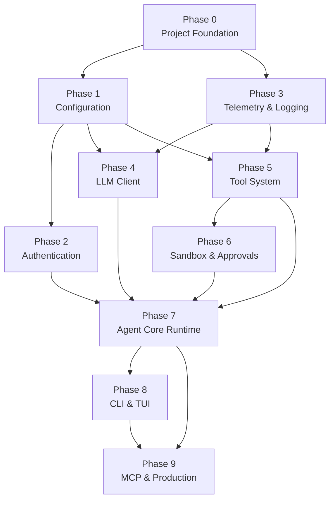

# Gemini CLI — Implementation Plan

## Table of Contents

- [1. Current State Analysis](#1-current-state-analysis)
- [2. Phase Dependency Map](#2-phase-dependency-map)
- [3. Phase 0 — Project Foundation](#3-phase-0--project-foundation)
- [4. Phase 1 — Configuration and Project Context](#4-phase-1--configuration-and-project-context)
- [5. Phase 2 — Authentication and Credential Management](#5-phase-2--authentication-and-credential-management)
- [6. Phase 3 — Telemetry and Logging](#6-phase-3--telemetry-and-logging)
- [7. Phase 4 — LLM Client](#7-phase-4--llm-client)
- [8. Phase 5 — Tool System](#8-phase-5--tool-system)
- [9. Phase 6 — Sandbox and Approvals](#9-phase-6--sandbox-and-approvals)
- [10. Phase 7 — Agent Core Runtime](#10-phase-7--agent-core-runtime)
- [11. Phase 8 — CLI and Terminal UI](#11-phase-8--cli-and-terminal-ui)
- [12. Phase 9 — MCP Integration and Production Readiness](#12-phase-9--mcp-integration-and-production-readiness)
- [13. Future Extensions](#13-future-extensions)

---

## 1. Current State Analysis

### What exists

| Item | Path | Notes |
|------|------|-------|
| Agent coding rules | `AGENT.md` | Detailed coding standards, security, LLM rules |
| Product description | `README.md` | Feature list, planned stack, UI mockups |
| Architecture document | `documentation/core/architecture.md` | Package layout, component contracts, flows |
| UI mockups (6 screens) | `documentation/ui/model/Terminal-*.png` | Interactive REPL, commands, quota, models, auth, roles |
| Banner image | `public/Banner.png` | Repository branding |
| Environment file | `.env` | API key, model, timeouts (git-ignored) |
| Gitignore | `.gitignore` | Standard Python gitignore |
| License | `LICENSE` | Apache License 2.0 |
| Virtual environment | `.venv/` | Python 3.14 (system default), `google-genai` SDK already installed |

### Python Target Version Policy

The project officially targets **Python 3.11, 3.12, and 3.13** (`>=3.11, <3.14`).
Although the local Linux `.venv` was initialized with Python 3.14, targeting
`>=3.11, <3.14` guarantees stability across ecosystem dependencies, pre-built
C-extensions, and package wheels. Python 3.14 is treated as experimental until
its official general availability.

- Primary recommended development version: **Python 3.12**
- Supported runtime matrix: **3.11, 3.12, 3.13**
- Pinned in `.python-version`: `3.12`

### What does not exist

- `pyproject.toml` — no package definition at all.
- `src/` directory — no Python source code.
- `tests/` directory — no test infrastructure.
- `.env.example` — no safe credential template.
- `GEMINI.md.example` — no project-context example.
- CI/CD pipeline — no GitHub Actions workflow.
- Any runnable entry point.

### Pre-installed packages in `.venv`

The virtual environment already contains `google-genai` and its transitive
dependencies (`google-auth`, `httpx`, `pydantic`, `protobuf`, `websockets`,
etc.). All new dependencies must be declared in `pyproject.toml` and managed
through `uv`.

---

## 2. Phase Dependency Map



Phases 1 and 3 can proceed in parallel once Phase 0 is complete. Phases 4 and
5 can proceed in parallel once their shared prerequisite (Phase 1) is
complete. Phase 7 is the convergence point where all lower layers meet.

---

## 3. Phase 0 — Project Foundation

**Goal:** Create a valid, installable Python package with tooling so that
`uv sync`, `python -m gemini_agent`, and `gemini-cli --version` succeed.

### 3.1 Package definition — `pyproject.toml`

Create `pyproject.toml` in the repository root with the following sections:

```toml
[project]
name = "gemini-cli"
version = "0.1.0"
description = "A Gemini-first command-line agent for everyday work."
readme = "README.md"
license = { text = "Apache-2.0" }
requires-python = ">=3.11, <3.14"
dependencies = [
    "google-genai>=1.0",
    "typer>=0.15",
    "rich>=13.0",
    "prompt-toolkit>=3.0.40",
    "pydantic>=2.0",
    "pydantic-settings>=2.0",
    "jinja2>=3.1",
    "keyring>=25.0",
    "httpx>=0.27",
]

[project.optional-dependencies]
dev = [
    "pytest>=8.0",
    "pytest-asyncio>=0.24",
    "pytest-cov>=6.0",
    "ruff>=0.8",
    "mypy>=1.13",
]

[project.scripts]
gemini-cli = "gemini_agent.cli.app:main"

[build-system]
requires = ["hatchling"]
build-backend = "hatchling.build"

[tool.hatch.build.targets.wheel]
packages = ["src/gemini_agent"]
```

**Key decisions:**

- `src` layout to prevent accidental imports from the project root.
- `hatchling` as a lightweight, standards-compliant build backend.
- Python target pinned to `>=3.11, <3.14` to guarantee library/C-extension compatibility across Linux/macOS/Windows, with `.python-version` set to `3.12`.
- `prompt-toolkit` added alongside `rich` to support advanced REPL input: arrow-key interactive selection menus, slash command autocompletion, multi-line handling, and Escape key cancellation as required by mockups `Terminal-2.png` through `Terminal-6.png`.
- Development dependencies are separated into `[project.optional-dependencies]`.
- The `gemini-cli` entry point maps to `gemini_agent.cli.app:main`.

### 3.2 Source directory skeleton

Create the following directory tree with minimal placeholder files. Every
`__init__.py` should be empty or contain only the package docstring. The
purpose of this step is to have a valid importable package, not to implement
any logic.

```
src/
└── gemini_agent/
    ├── __init__.py          # __version__ = "0.1.0"
    ├── __main__.py          # Entry point: from gemini_agent.cli.app import main; main()
    ├── cli/
    │   ├── __init__.py
    │   ├── app.py           # Typer app with --version callback
    │   ├── commands/
    │   │   ├── __init__.py
    │   │   ├── chat.py      # Placeholder
    │   │   ├── run.py       # Placeholder
    │   │   ├── auth.py      # Placeholder
    │   │   ├── mcp.py       # Placeholder
    │   │   └── config.py    # Placeholder
    │   └── tui/
    │       ├── __init__.py
    │       ├── repl.py      # Placeholder
    │       └── themes.py    # Placeholder
    ├── core/
    │   ├── __init__.py
    │   ├── agent.py         # Placeholder
    │   ├── session.py       # Placeholder
    │   ├── streaming.py     # Placeholder
    │   ├── context_manager.py  # Placeholder
    │   └── quota_tracker.py # Placeholder - Local client-side token accounting
    ├── llm/
    │   ├── __init__.py
    │   ├── client.py        # Placeholder
    │   ├── models.py        # Placeholder
    │   ├── retry.py         # Placeholder
    │   └── prompts/
    │       ├── __init__.py
    │       ├── system.py    # Placeholder
    │       └── templates/   # Empty directory for .jinja2 files
    ├── tools/
    │   ├── __init__.py
    │   ├── base.py          # Placeholder
    │   ├── registry.py      # Placeholder
    │   ├── filesystem/
    │   │   └── __init__.py
    │   ├── shell/
    │   │   └── __init__.py
    │   ├── web/
    │   │   └── __init__.py
    │   └── code/
    │       └── __init__.py
    ├── mcp/
    │   ├── __init__.py
    │   ├── client.py        # Placeholder
    │   ├── discovery.py     # Placeholder
    │   └── server_config.py # Placeholder
    ├── sandbox/
    │   ├── __init__.py
    │   ├── base.py          # Placeholder
    │   ├── docker_backend.py      # Placeholder
    │   ├── subprocess_backend.py  # Placeholder
    │   └── approval.py     # Placeholder
    ├── auth/
    │   ├── __init__.py
    │   ├── oauth.py         # Placeholder
    │   ├── api_key.py       # Placeholder
    │   └── credentials_store.py  # Placeholder
    ├── config/
    │   ├── __init__.py
    │   ├── settings.py      # Placeholder
    │   ├── project_context.py  # Placeholder
    │   └── defaults.py     # Placeholder
    └── telemetry/
        ├── __init__.py
        └── logger.py       # Placeholder
```

**`src/gemini_agent/__init__.py`:**

```python
"""Gemini CLI — A Gemini-first command-line agent for everyday work."""

__version__ = "0.1.0"
```

**`src/gemini_agent/__main__.py`:**

```python
"""Allow running with `python -m gemini_agent`."""

from gemini_agent.cli.app import main

main()
```

**`src/gemini_agent/cli/app.py`** (minimal working CLI):

```python
"""Typer application and command registration."""

from __future__ import annotations

import typer

from gemini_agent import __version__

app = typer.Typer(
    name="gemini-cli",
    help="A Gemini-first command-line agent for everyday work.",
    no_args_is_help=True,
)


def version_callback(value: bool) -> None:
    if value:
        typer.echo(f"gemini-cli {__version__}")
        raise typer.Exit()


@app.callback()
def main_callback(
    version: bool = typer.Option(
        False,
        "--version",
        "-v",
        help="Show version and exit.",
        callback=version_callback,
        is_eager=True,
    ),
) -> None:
    """Gemini CLI — your daily AI companion in the terminal."""


def main() -> None:
    app()
```

### 3.3 Test infrastructure

```
tests/
├── __init__.py
├── conftest.py          # Shared fixtures, env overrides
├── unit/
│   ├── __init__.py
│   ├── config/
│   │   └── __init__.py
│   ├── auth/
│   │   └── __init__.py
│   ├── llm/
│   │   └── __init__.py
│   ├── tools/
│   │   └── __init__.py
│   ├── mcp/
│   │   └── __init__.py
│   ├── sandbox/
│   │   └── __init__.py
│   ├── core/
│   │   └── __init__.py
│   └── cli/
│       └── __init__.py
├── integration/
│   └── __init__.py
└── fixtures/
    └── mock_responses/    # Deterministic model and protocol responses
```

**`tests/conftest.py`:**

```python
"""Root conftest — shared fixtures and environment overrides."""

from __future__ import annotations

import os

import pytest


@pytest.fixture(autouse=True)
def _isolate_env(monkeypatch: pytest.MonkeyPatch) -> None:
    """Prevent tests from using real credentials or config."""
    monkeypatch.delenv("GEMINI_API_KEY", raising=False)
    monkeypatch.setenv("GEMINI_TELEMETRY_ENABLED", "false")
```

### 3.4 Tooling configuration in `pyproject.toml`

Append these sections to `pyproject.toml`:

```toml
[tool.pytest.ini_options]
testpaths = ["tests"]
asyncio_mode = "auto"
markers = [
    "integration: marks tests that require external services",
]

[tool.ruff]
target-version = "py311"
line-length = 88
src = ["src", "tests"]

[tool.ruff.lint]
select = [
    "E",    # pycodestyle errors
    "W",    # pycodestyle warnings
    "F",    # pyflakes
    "I",    # isort
    "N",    # pep8-naming
    "UP",   # pyupgrade
    "B",    # flake8-bugbear
    "SIM",  # flake8-simplify
    "RUF",  # Ruff-specific rules
]

[tool.ruff.lint.isort]
known-first-party = ["gemini_agent"]

[tool.mypy]
python_version = "3.11"
strict = true
warn_return_any = true
warn_unused_configs = true
packages = ["gemini_agent"]
mypy_path = "src"
```

### 3.5 Credential template — `.env.example`

```dotenv
# Required. Create a key at https://aistudio.google.com/apikey
GEMINI_API_KEY=your-api-key-here

# Optional runtime settings.
GEMINI_MODEL=gemini-2.5-flash
GEMINI_REQUEST_TIMEOUT_MS=60000
GEMINI_RETRY_ATTEMPTS=3
GEMINI_MAX_HISTORY_TURNS=20
GEMINI_MAX_INPUT_CHARS=32000
```

### 3.6 Project-context example — `GEMINI.md.example`

```markdown
# Project Instructions for Gemini CLI

These instructions are loaded automatically when Gemini CLI is run inside
this repository. They guide the agent's behavior but cannot override
security controls or approval requirements.

## Conventions

- Use American English in code comments and documentation.
- Follow the existing code style enforced by Ruff.
- Prefer standard library solutions when possible.
```

### 3.7 Pinned Python version — `.python-version`

Create `.python-version` in the repository root to pin the local development
and tooling standard:

```text
3.12
```

### 3.8 CI pipeline — `.github/workflows/ci.yml`

```yaml
name: CI

on:
  push:
    branches: [main]
  pull_request:
    branches: [main]

jobs:
  quality:
    runs-on: ubuntu-latest
    strategy:
      matrix:
        python-version: ["3.11", "3.12", "3.13"]
    steps:
      - uses: actions/checkout@v4
      - uses: astral-sh/setup-uv@v4
      - run: uv python install ${{ matrix.python-version }}
      - run: uv sync --all-extras
      - name: Lint
        run: uv run ruff check src/ tests/
      - name: Format check
        run: uv run ruff format --check src/ tests/
      - name: Type check
        run: uv run mypy
      - name: Test
        run: uv run pytest --cov=gemini_agent --cov-report=term-missing
```

### 3.9 Acceptance criteria

- [ ] `.python-version` specifies `3.12`.
- [ ] `uv sync` installs the package and all dependencies without errors.
- [ ] `uv run gemini-cli --version` prints `gemini-cli 0.1.0`.
- [ ] `uv run python -m gemini_agent --version` prints the same.
- [ ] `uv run ruff check src/ tests/` passes with zero violations.
- [ ] `uv run ruff format --check src/ tests/` passes.
- [ ] `uv run mypy` passes with zero errors.
- [ ] `uv run pytest` discovers the test directory and passes (zero tests
  collected is acceptable at this stage).
- [ ] All placeholder modules are importable: `from gemini_agent.core import
  agent`, `from gemini_agent.tools import registry`, etc.

---

## 4. Phase 1 — Configuration and Project Context

**Goal:** Provide a single validated settings object that the rest of the
application consumes, with predictable precedence and project-instruction
discovery.

**Depends on:** Phase 0.

### 4.1 Default values — `src/gemini_agent/config/defaults.py`

Define all built-in defaults as typed constants:

```python
"""Safe built-in default values for all configuration options."""

from __future__ import annotations

# Model defaults
DEFAULT_MODEL: str = "gemini-2.5-flash"
DEFAULT_REQUEST_TIMEOUT_MS: int = 60_000
DEFAULT_RETRY_ATTEMPTS: int = 3

# Conversation limits
DEFAULT_MAX_HISTORY_TURNS: int = 20
DEFAULT_MAX_INPUT_CHARS: int = 32_000
DEFAULT_MAX_AGENT_ITERATIONS: int = 25
DEFAULT_MAX_OUTPUT_TOKENS: int = 8_192

# Filesystem safety
DEFAULT_ALLOWED_EXTENSIONS: tuple[str, ...] = (
    ".py", ".md", ".txt", ".json", ".toml", ".yaml", ".yml",
    ".cfg", ".ini", ".sh", ".bash", ".html", ".css", ".js",
    ".ts", ".sql", ".csv", ".xml", ".env.example",
)
DEFAULT_MAX_FILE_SIZE_BYTES: int = 1_048_576  # 1 MB

# Shell execution
DEFAULT_SHELL_TIMEOUT_SECONDS: int = 30
DEFAULT_SHELL_MAX_OUTPUT_BYTES: int = 524_288  # 512 KB

# Project context
PROJECT_INSTRUCTION_FILES: tuple[str, ...] = ("GEMINI.md", "AGENTS.md")

# Telemetry
DEFAULT_TELEMETRY_ENABLED: bool = False

# Roles
DEFAULT_ROLE: str = "basic"
AVAILABLE_ROLES: tuple[str, ...] = (
    "basic",
    "code",
    "creator",
    "analyser",
    "poet",
)

# Config file paths
GLOBAL_CONFIG_DIR_NAME: str = ".gemini-cli"
PROJECT_CONFIG_FILE_NAME: str = ".gemini-cli.toml"
```

### 4.2 Settings model — `src/gemini_agent/config/settings.py`

Use Pydantic Settings to compose the final configuration object. The
precedence is: environment variables > project config file > global config
file > built-in defaults.

```python
"""Typed application settings with layered precedence."""

from __future__ import annotations

from pathlib import Path
from typing import Literal

from pydantic import Field, field_validator
from pydantic_settings import BaseSettings, SettingsConfigDict

from gemini_agent.config.defaults import (
    AVAILABLE_ROLES,
    DEFAULT_MAX_AGENT_ITERATIONS,
    DEFAULT_MAX_FILE_SIZE_BYTES,
    DEFAULT_MAX_HISTORY_TURNS,
    DEFAULT_MAX_INPUT_CHARS,
    DEFAULT_MAX_OUTPUT_TOKENS,
    DEFAULT_MODEL,
    DEFAULT_REQUEST_TIMEOUT_MS,
    DEFAULT_RETRY_ATTEMPTS,
    DEFAULT_ROLE,
    DEFAULT_SHELL_MAX_OUTPUT_BYTES,
    DEFAULT_SHELL_TIMEOUT_SECONDS,
    DEFAULT_TELEMETRY_ENABLED,
)


class Settings(BaseSettings):
    """Application-wide settings validated at startup.

    Values are resolved with the following precedence:
    1. Environment variables (prefixed with ``GEMINI_``).
    2. Project-level ``.gemini-cli.toml`` in the working directory.
    3. Global ``~/.gemini-cli/config.toml``.
    4. Built-in defaults from ``defaults.py``.
    """

    model_config = SettingsConfigDict(
        env_prefix="GEMINI_",
        env_file=".env",
        env_file_encoding="utf-8",
        extra="ignore",
    )

    # --- API ---
    api_key: str = Field(default="", description="Gemini API key.")
    model: str = Field(default=DEFAULT_MODEL)
    request_timeout_ms: int = Field(default=DEFAULT_REQUEST_TIMEOUT_MS, gt=0)
    retry_attempts: int = Field(default=DEFAULT_RETRY_ATTEMPTS, ge=0, le=10)

    # --- Conversation ---
    max_history_turns: int = Field(default=DEFAULT_MAX_HISTORY_TURNS, ge=1)
    max_input_chars: int = Field(default=DEFAULT_MAX_INPUT_CHARS, ge=100)
    max_agent_iterations: int = Field(default=DEFAULT_MAX_AGENT_ITERATIONS, ge=1)
    max_output_tokens: int = Field(default=DEFAULT_MAX_OUTPUT_TOKENS, ge=1)

    # --- Filesystem ---
    allowed_roots: list[Path] = Field(default_factory=list)
    max_file_size_bytes: int = Field(default=DEFAULT_MAX_FILE_SIZE_BYTES, gt=0)

    # --- Shell ---
    shell_timeout_seconds: int = Field(default=DEFAULT_SHELL_TIMEOUT_SECONDS, gt=0)
    shell_max_output_bytes: int = Field(default=DEFAULT_SHELL_MAX_OUTPUT_BYTES, gt=0)

    # --- Role ---
    role: str = Field(default=DEFAULT_ROLE)

    # --- Telemetry ---
    telemetry_enabled: bool = Field(default=DEFAULT_TELEMETRY_ENABLED)

    @field_validator("role")
    @classmethod
    def validate_role(cls, v: str) -> str:
        v = v.lower().strip()
        if v not in AVAILABLE_ROLES:
            msg = f"Unknown role '{v}'. Available: {', '.join(AVAILABLE_ROLES)}"
            raise ValueError(msg)
        return v
```

**Key design decisions:**

- A single `Settings` instance is created once during startup and passed
  explicitly to components that need it. Lower layers never read environment
  variables directly.
- The `api_key` field defaults to an empty string. Missing or empty keys are
  caught at the authentication layer rather than during settings construction,
  so that commands like `--version` or `config show` work without credentials.
- `allowed_roots` defaults to an empty list; the CLI layer populates it with
  the current working directory at startup.

### 4.3 Project context discovery — `src/gemini_agent/config/project_context.py`

```python
"""Discover and load project-level instruction files."""

from __future__ import annotations

import logging
from dataclasses import dataclass, field
from pathlib import Path

from gemini_agent.config.defaults import PROJECT_INSTRUCTION_FILES

logger = logging.getLogger(__name__)


@dataclass(frozen=True)
class ProjectContext:
    """Loaded project instructions and their source paths."""

    instructions: str = ""
    source_files: tuple[Path, ...] = field(default_factory=tuple)


def load_project_context(search_root: Path) -> ProjectContext:
    """Walk up from *search_root* looking for instruction files.

    Each file found in ``PROJECT_INSTRUCTION_FILES`` is read and concatenated
    in declaration order. The search stops at the filesystem root.

    Project context is treated as untrusted input. It can guide agent behavior
    but cannot override security controls, credential handling, or approval
    requirements.
    """
    found_parts: list[str] = []
    found_paths: list[Path] = []

    current = search_root.resolve()
    while True:
        for name in PROJECT_INSTRUCTION_FILES:
            candidate = current / name
            if candidate.is_file():
                try:
                    text = candidate.read_text(encoding="utf-8")
                    found_parts.append(text)
                    found_paths.append(candidate)
                    logger.info("Loaded project instructions from %s", candidate)
                except OSError:
                    logger.warning("Could not read %s", candidate)
        parent = current.parent
        if parent == current:
            break
        current = parent

    return ProjectContext(
        instructions="\n\n".join(found_parts),
        source_files=tuple(found_paths),
    )
```

### 4.4 Config `__init__.py` — public API

```python
"""Configuration package — public surface."""

from gemini_agent.config.project_context import ProjectContext, load_project_context
from gemini_agent.config.settings import Settings

__all__ = ["ProjectContext", "Settings", "load_project_context"]
```

### 4.5 Tests — `tests/unit/config/`

| Test file | What it validates |
|-----------|-------------------|
| `test_defaults.py` | All default constants are of the expected type and within sane ranges. |
| `test_settings.py` | Settings are created from env vars, missing optional env vars fall back to defaults, invalid role raises `ValidationError`, `api_key` allows empty string, `request_timeout_ms` rejects zero and negative. |
| `test_project_context.py` | Discovers `GEMINI.md` in the current directory, discovers `AGENTS.md` one level up, returns empty context when nothing found, handles unreadable files gracefully. |

### 4.6 Acceptance criteria

- [ ] `Settings()` can be constructed with no environment variables set (all
  defaults apply).
- [ ] Setting `GEMINI_MODEL=gemini-2.5-pro` via env correctly overrides the
  default.
- [ ] Invalid role value raises `pydantic.ValidationError`.
- [ ] `load_project_context()` returns combined instructions from found files.
- [ ] `load_project_context()` returns empty `ProjectContext` when no files
  exist.
- [ ] All tests pass with `uv run pytest tests/unit/config/`.

---

## 5. Phase 2 — Authentication and Credential Management

**Goal:** Support API-key authentication with secure storage and provide a
stub for future Google OAuth support.

**Depends on:** Phase 1 (settings).

### 5.1 API key provider — `src/gemini_agent/auth/api_key.py`

```python
"""API key resolution: environment → keyring → prompt."""

from __future__ import annotations

import logging
from dataclasses import dataclass

logger = logging.getLogger(__name__)


@dataclass(frozen=True)
class ResolvedApiKey:
    """A resolved API key with its source for diagnostics."""

    key: str
    source: str  # "environment", "keyring", "prompt"
```

Implement a function `resolve_api_key(settings: Settings) -> ResolvedApiKey`
that checks, in order:

1. `settings.api_key` (already loaded from environment / `.env`).
2. System keyring via `keyring.get_password("gemini-cli", "api-key")`.
3. Returns an error or raises `AuthenticationError` if nothing found.

### 5.2 Credential store — `src/gemini_agent/auth/credentials_store.py`

The credential store is the **only** component that interacts with persistent
secret storage.

```python
"""Persistent credential storage using the OS keyring."""

from __future__ import annotations

import keyring

SERVICE_NAME = "gemini-cli"


def store_api_key(api_key: str) -> None: ...
def load_api_key() -> str | None: ...
def delete_api_key() -> None: ...
def has_stored_credentials() -> bool: ...
```

All functions must:

- Catch `keyring.errors.KeyringError` and raise a domain-specific error.
- Never log, print, or include the actual key value in error messages.

### 5.3 OAuth stub — `src/gemini_agent/auth/oauth.py`

Create a module with a single class `OAuthProvider` whose methods raise
`NotImplementedError("Google OAuth is not yet supported.")`. This signals
intent without adding dead code.

### 5.4 Auth exceptions — `src/gemini_agent/auth/__init__.py`

```python
"""Authentication package."""


class AuthenticationError(Exception):
    """Raised when credentials cannot be resolved."""


class CredentialStoreError(Exception):
    """Raised when the OS keyring is unavailable or fails."""
```

### 5.5 Tests — `tests/unit/auth/`

| Test file | What it validates |
|-----------|-------------------|
| `test_api_key.py` | Key resolved from settings, fallback to keyring mock, error when no key available. |
| `test_credentials_store.py` | Store/load/delete round-trip with mocked keyring, graceful error when keyring unavailable. |

### 5.6 Acceptance criteria

- [ ] API key from `GEMINI_API_KEY` env var is resolved without touching keyring.
- [ ] When env var is empty, keyring is queried.
- [ ] `store_api_key` → `load_api_key` round-trip succeeds with mocked keyring.
- [ ] Real API key values never appear in logs or error messages.
- [ ] `OAuthProvider` methods raise `NotImplementedError`.
- [ ] All tests pass: `uv run pytest tests/unit/auth/`.

---

## 6. Phase 3 — Telemetry and Logging

**Goal:** Structured application logging with secret redaction and opt-in
telemetry foundation.

**Depends on:** Phase 0.

### 6.1 Logger setup — `src/gemini_agent/telemetry/logger.py`

Implement the following:

1. **`configure_logging(level, telemetry_enabled)`** — Called once at startup.
   Sets up structured JSON logging for file output and human-readable Rich
   console output for stderr.

2. **`RedactingFilter`** — A `logging.Filter` that scans log record messages
   and arguments for patterns that look like API keys, tokens, or passwords,
   and replaces them with `[REDACTED]`. Patterns to detect:
   - Strings matching `(?:key|token|password|secret|credential)[\s=:]+\S+`
   - Strings that look like Gemini API keys (prefix `AIza` or similar known
     patterns).

3. **Telemetry data classes:**

```python
@dataclass
class ModelCallEvent:
    """Recorded after each model API call."""
    model: str
    duration_ms: float
    input_tokens: int
    output_tokens: int
    cached_tokens: int
    status: str  # "success", "error", "timeout", "rate_limited"
    retry_count: int


@dataclass
class ToolCallEvent:
    """Recorded after each tool execution."""
    tool_name: str
    duration_ms: float
    status: str  # "success", "denied", "timeout", "error"
    # Tool arguments and outputs are NOT recorded.
```

4. Telemetry events are logged at `DEBUG` level. When `telemetry_enabled` is
   `False`, the telemetry handler is not attached and events are discarded.

### 6.2 Tests — `tests/unit/telemetry/`

| Test file | What it validates |
|-----------|-------------------|
| `test_logger.py` | `configure_logging` sets the correct level, redacting filter strips API keys from messages, telemetry events are suppressed when disabled, JSON output is valid. |

### 6.3 Acceptance criteria

- [ ] `configure_logging("DEBUG", False)` attaches console handler but not
  telemetry handler.
- [ ] A log message containing `"api_key=AIzaSyB..."` is output as
  `"api_key=[REDACTED]"`.
- [ ] `ModelCallEvent` and `ToolCallEvent` never include prompt content or
  tool arguments.
- [ ] All tests pass: `uv run pytest tests/unit/telemetry/`.

---

## 7. Phase 4 — LLM Client

**Goal:** A Gemini client that wraps `google-genai`, handles model selection,
retry, fallback, streaming, and prompt composition — all behind a narrow
interface that the agent core can consume without importing the SDK.

**Depends on:** Phase 1 (settings), Phase 3 (telemetry).

### 7.1 Model definitions — `src/gemini_agent/llm/models.py`

Define supported models, their properties, and fallback rules.

```python
"""Supported Gemini models and fallback policies."""

from __future__ import annotations

from dataclasses import dataclass
from enum import Enum


class ModelTier(str, Enum):
    FLASH = "flash"
    PRO = "pro"


@dataclass(frozen=True)
class ModelInfo:
    """Metadata for a supported Gemini model."""

    name: str
    display_name: str
    tier: ModelTier
    context_window: int
    max_output_tokens: int
    description: str
    fallback: str | None = None  # Model name to fall back to.


# Registry of all known models.
MODEL_REGISTRY: dict[str, ModelInfo] = { ... }
```

Populate the registry from the UI mockups:

| Model name | Tier | Description |
|-----------|------|-------------|
| `gemini-2.5-flash` | flash | Best for fast, simple tasks (chat, short text, basic code) |
| `gemini-2.5-pro` | pro | Best for complex reasoning, long documents, multi-step tasks |

Include helper functions:

- `get_model(name: str) -> ModelInfo` — look up or raise `UnknownModelError`.
- `get_fallback(name: str) -> ModelInfo | None` — resolve the fallback chain.
- `list_models() -> list[ModelInfo]` — all available models.

### 7.2 Retry logic — `src/gemini_agent/llm/retry.py`

```python
"""Bounded exponential backoff for transient Gemini API errors."""

from __future__ import annotations

import asyncio
import logging
from collections.abc import Awaitable, Callable
from dataclasses import dataclass
from typing import TypeVar

logger = logging.getLogger(__name__)
T = TypeVar("T")


@dataclass(frozen=True)
class RetryPolicy:
    max_attempts: int = 3
    base_delay_seconds: float = 1.0
    max_delay_seconds: float = 30.0
    jitter: bool = True
    retryable_status_codes: frozenset[int] = frozenset({429, 500, 503})


async def with_retry(
    func: Callable[[], Awaitable[T]],
    policy: RetryPolicy,
) -> T: ...
```

**Rules:**

- Never retry non-transient errors (400, 401, 403, 404).
- Log each retry attempt with attempt number and delay.
- Respect `Retry-After` headers when present.
- Stop after `max_attempts` and raise the last exception.

### 7.3 Gemini client — `src/gemini_agent/llm/client.py`

The client exposes two core methods:

```python
class GeminiClient:
    """Async wrapper around google-genai."""

    def __init__(self, settings: Settings, *, api_key: str) -> None: ...

    async def generate(
        self,
        messages: list[Message],
        tools: list[ToolDefinition] | None = None,
        system_instruction: str | None = None,
    ) -> ModelResponse: ...

    async def generate_stream(
        self,
        messages: list[Message],
        tools: list[ToolDefinition] | None = None,
        system_instruction: str | None = None,
    ) -> AsyncIterator[StreamEvent]: ...
```

**Internal data models** (not SDK types — these are the application's own
representations):

```python
@dataclass
class Message:
    role: Literal["user", "assistant", "tool"]
    content: str
    tool_call_id: str | None = None

@dataclass
class ToolCallRequest:
    id: str
    name: str
    arguments: dict[str, Any]

@dataclass
class ModelResponse:
    content: str | None
    tool_calls: list[ToolCallRequest]
    usage: UsageInfo
    model: str
    finish_reason: str

@dataclass
class UsageInfo:
    input_tokens: int
    output_tokens: int
    cached_tokens: int
    total_tokens: int

@dataclass
class StreamEvent:
    event_type: Literal["text_delta", "tool_call_delta", "usage", "done", "error"]
    data: Any
```

The client is responsible for:

1. Creating and caching the `google.genai.Client` instance.
2. Mapping `Message` → SDK `Content` objects.
3. Mapping `ToolDefinition` → SDK `Tool` declarations.
4. Calling `client.aio.models.generate_content` (or streaming variant).
5. Mapping SDK response → `ModelResponse` / `StreamEvent`.
6. Applying `RetryPolicy` from `retry.py`.
7. Logging `ModelCallEvent` telemetry.
8. Applying model fallback when the primary model returns an unrecoverable
   error and a fallback is defined.

### 7.4 Streaming Tool Call and Thought Accumulation

When calling `generate_stream()`, the Gemini model may emit chunks containing
text, thoughts/reasoning parts, or function calls:

1. **Immediate Text Streaming:** Chunks with text deltas are immediately yielded
   as `StreamEvent(event_type="text_delta", data=chunk_text)` to provide
   real-time character streaming in the TUI.
2. **Tool Call Accumulation Buffer:** Tool call arguments can arrive split
   across multiple streaming parts. `llm/client.py` buffers incoming
   `function_call` tokens, reconstructing the complete function call:
   - Tool name is captured upon first occurrence.
   - Partial JSON argument strings or dict structures are merged.
   - Only when the function call block finishes is the JSON validated and
     emitted as a complete `ToolCallRequest` within a
     `StreamEvent(event_type="tool_call_delta", data=tool_call_req)`.
   - This prevents partial, malformed JSON from reaching `ToolRegistry.dispatch()`.
3. **Usage and Finish Events:** Once the stream closes, token usage metadata
   is captured into `UsageInfo` and emitted as `StreamEvent(event_type="usage")`
   followed by `StreamEvent(event_type="done")`.

### 7.5 System prompt composition — `src/gemini_agent/llm/prompts/system.py`

```python
"""System-instruction assembly and Jinja template rendering."""

from __future__ import annotations

from pathlib import Path

from jinja2 import Environment, FileSystemLoader

TEMPLATES_DIR = Path(__file__).parent / "templates"


def build_system_prompt(
    role: str,
    project_instructions: str = "",
    tool_names: list[str] | None = None,
) -> str:
    """Render the system prompt for the active role.

    Project instructions are appended as untrusted context and clearly
    delimited from trusted system instructions.
    """
    ...
```

### 7.6 Prompt templates — `src/gemini_agent/llm/prompts/templates/`

Create Jinja2 templates:

- `base.jinja2` — shared preamble (identity, safety rules, output format).
- `role_basic.jinja2` — general assistant.
- `role_code.jinja2` — coding and technical problem-solving.
- `role_creator.jinja2` — ideas, concepts, creative direction.
- `role_analyser.jinja2` — deep analysis and clear insights.
- `role_poet.jinja2` — poetry, prose, expressive writing.
- `tools_preamble.jinja2` — instructions for tool use.
- `project_context.jinja2` — wraps project instructions with untrusted-input
  delimiter.

### 7.7 Tests — `tests/unit/llm/`

| Test file | What it validates |
|-----------|-------------------|
| `test_models.py` | `get_model` returns correct info, unknown model raises error, fallback chain resolves, `list_models` is non-empty. |
| `test_retry.py` | Retries on 429/500/503 up to max, no retry on 400/401, respects jitter and max delay, final exception is raised after exhaustion. |
| `test_client.py` | SDK `generate_content` is called with correctly mapped messages and tools, response is mapped to `ModelResponse`, streaming yields expected `StreamEvent` sequence, function call chunks are properly accumulated before execution, fallback is triggered on 5xx, API key is never logged. Uses mocked SDK. |
| `test_prompts.py` | `build_system_prompt` renders the correct role template, project instructions are delimited, missing template raises clear error. |

### 7.8 Acceptance criteria

- [ ] `GeminiClient` can be instantiated with test settings and a dummy key.
- [ ] `generate()` with a mocked SDK returns a valid `ModelResponse`.
- [ ] `generate_stream()` with a mocked SDK yields `text_delta` then `done`.
- [ ] `generate_stream()` properly buffers multi-chunk tool calls into a valid `ToolCallRequest`.
- [ ] Retry logic stops after `max_attempts`.
- [ ] Fallback switches to the fallback model on supported errors.
- [ ] System prompt renders differently for each role.
- [ ] No SDK types leak into the public interface of `llm/`.
- [ ] All tests pass: `uv run pytest tests/unit/llm/`.

---

## 8. Phase 5 — Tool System

**Goal:** A validated tool registry that exposes built-in capabilities to the
agent through a uniform interface, with JSON Schema export for model
declarations.

**Depends on:** Phase 1 (settings), Phase 3 (telemetry).

### 8.1 Base tool contract — `src/gemini_agent/tools/base.py`

```python
"""Base classes for the tool system."""

from __future__ import annotations

from abc import ABC, abstractmethod
from dataclasses import dataclass, field
from enum import Enum
from typing import Any

from pydantic import BaseModel


class ToolCategory(str, Enum):
    FILESYSTEM = "filesystem"
    SHELL = "shell"
    WEB = "web"
    CODE = "code"
    MCP = "mcp"


class RiskLevel(str, Enum):
    """Used by the approval layer to decide whether confirmation is needed."""
    READ = "read"          # No side effects.
    WRITE = "write"        # Creates or modifies resources.
    DESTRUCTIVE = "destructive"  # Deletes resources or runs shell commands.


@dataclass(frozen=True)
class ToolResult:
    """Structured result returned to the agent loop."""
    success: bool
    output: str
    error: str | None = None
    metadata: dict[str, Any] = field(default_factory=dict)


class BaseTool(ABC):
    """Contract that every tool must implement."""

    @property
    @abstractmethod
    def name(self) -> str:
        """Unique tool name used in model declarations and dispatch."""

    @property
    @abstractmethod
    def description(self) -> str:
        """Human-readable description included in model tool declarations."""

    @property
    @abstractmethod
    def parameters_schema(self) -> type[BaseModel]:
        """Pydantic model that validates and documents tool parameters."""

    @property
    @abstractmethod
    def category(self) -> ToolCategory: ...

    @property
    @abstractmethod
    def risk_level(self) -> RiskLevel: ...

    @abstractmethod
    async def execute(self, params: BaseModel) -> ToolResult:
        """Run the tool with validated parameters and return a result."""
```

### 8.2 Tool registry — `src/gemini_agent/tools/registry.py`

```python
class ToolRegistry:
    """Central registry for all tools available to the agent."""

    def register(self, tool: BaseTool) -> None:
        """Register a tool. Raises on duplicate names."""

    def get(self, name: str) -> BaseTool:
        """Look up a tool by name. Raises ToolNotFoundError."""

    def list_tools(self) -> list[BaseTool]:
        """Return all registered tools."""

    def export_schemas(self) -> list[dict[str, Any]]:
        """Export JSON-Schema-compatible declarations for model tool use."""

    async def dispatch(self, name: str, arguments: dict[str, Any]) -> ToolResult:
        """Validate arguments, execute the tool, and return the result.

        Steps:
        1. Look up the tool by name.
        2. Validate ``arguments`` against ``tool.parameters_schema``.
        3. Execute ``tool.execute(validated_params)``.
        4. Log a ``ToolCallEvent``.
        5. Return ``ToolResult``.
        """
```

### 8.3 Filesystem tools — `src/gemini_agent/tools/filesystem/`

Implement the following tools as separate modules within the package:

#### `read_file.py`

| Property | Value |
|----------|-------|
| Name | `read_file` |
| Risk | `READ` |
| Parameters | `path: str`, `start_line: int \| None`, `end_line: int \| None` |
| Behavior | Read a text file from an approved root. Return line-numbered content. Reject binary files, symlinks outside roots, and paths with traversal. |

#### `write_file.py`

| Property | Value |
|----------|-------|
| Name | `write_file` |
| Risk | `WRITE` |
| Parameters | `path: str`, `content: str`, `create_directories: bool = False` |
| Behavior | Create or overwrite a file. Validate path, size limits, and encoding. |

#### `edit_file.py`

| Property | Value |
|----------|-------|
| Name | `edit_file` |
| Risk | `WRITE` |
| Parameters | `path: str`, `target_content: str`, `replacement_content: str`, `start_line: int`, `end_line: int` |
| Behavior | Replace a specific block of text within a file. Validate that `target_content` matches exactly. |

#### `find_files.py`

| Property | Value |
|----------|-------|
| Name | `find_files` |
| Risk | `READ` |
| Parameters | `pattern: str`, `root: str \| None`, `max_results: int = 100` |
| Behavior | Glob-based file search within approved roots. |

#### `grep.py`

| Property | Value |
|----------|-------|
| Name | `grep` |
| Risk | `READ` |
| Parameters | `query: str`, `path: str \| None`, `include_pattern: str \| None`, `max_results: int = 50` |
| Behavior | Regex search across files in approved roots. Return file paths, line numbers, and matching lines. |

#### Path validation — `path_validator.py`

A shared utility used by all filesystem tools:

```python
def validate_path(
    path: str | Path,
    allowed_roots: list[Path],
    *,
    must_exist: bool = False,
    must_be_file: bool = False,
) -> Path:
    """Resolve and validate a path against allowed roots.

    Raises PathSecurityError if:
    - The resolved path is not under any allowed root.
    - The path contains traversal components (``..`` that escape roots).
    - The path is a symlink pointing outside allowed roots.
    """
```

### 8.4 Shell tool — `src/gemini_agent/tools/shell/`

#### `run_command.py`

| Property | Value |
|----------|-------|
| Name | `run_command` |
| Risk | `DESTRUCTIVE` |
| Parameters | `command: str`, `working_directory: str \| None`, `timeout_seconds: int \| None` |
| Behavior | Delegate execution to the sandbox backend (Phase 6). Until the sandbox is implemented, this tool returns a `ToolResult` with `success=False` and an explanation. |

### 8.5 Web tools — `src/gemini_agent/tools/web/`

#### `fetch_url.py`

| Property | Value |
|----------|-------|
| Name | `fetch_url` |
| Risk | `READ` |
| Parameters | `url: str`, `max_bytes: int = 524288` |
| Behavior | Fetch a URL via `httpx`, validate the URL scheme (http/https only), enforce size limit, return text content. Reject private/internal IPs to prevent SSRF. |

### 8.6 Code tools — `src/gemini_agent/tools/code/`

#### `code_search.py`

| Property | Value |
|----------|-------|
| Name | `code_search` |
| Risk | `READ` |
| Parameters | `query: str`, `file_extensions: list[str] \| None`, `max_results: int = 30` |
| Behavior | Focused search across source files using regex. Similar to `grep` but defaults to source-code extensions and formats results with surrounding context lines. |

### 8.7 Tests — `tests/unit/tools/`

| Test file | What it validates |
|-----------|-------------------|
| `test_base.py` | `ToolResult` construction, `RiskLevel` enum values. |
| `test_registry.py` | Registration, duplicate-name rejection, lookup, `export_schemas` produces valid JSON Schema, `dispatch` validates args and returns result. |
| `test_path_validator.py` | Allowed paths pass, `..` traversal rejected, symlinks outside roots rejected, non-existent path with `must_exist=True` raises. |
| `test_read_file.py` | Reads file content, respects line ranges, rejects binary, rejects path outside roots. |
| `test_write_file.py` | Creates file, overwrites existing, rejects oversized content, rejects path outside roots. |
| `test_edit_file.py` | Replaces target content, rejects when target not found, rejects when multiple matches. |
| `test_find_files.py` | Glob patterns work, respects max results, restricted to roots. |
| `test_grep.py` | Regex search finds matches, handles invalid regex, respects max results. |
| `test_fetch_url.py` | Fetches mocked URL, rejects `file://`, rejects private IPs, enforces size limit. |

### 8.8 Acceptance criteria

- [ ] All tools can be registered in `ToolRegistry` without name collisions.
- [ ] `export_schemas()` returns valid JSON Schema for every registered tool.
- [ ] `dispatch("read_file", {"path": "/etc/passwd"})` is rejected when
  `/etc/` is not in `allowed_roots`.
- [ ] Path traversal via `../../etc/passwd` is detected and rejected.
- [ ] `fetch_url` with a `file:///` URL is rejected.
- [ ] `run_command` returns a "not available" result until sandbox is
  implemented.
- [ ] All tests pass: `uv run pytest tests/unit/tools/`.

---

## 9. Phase 6 — Sandbox and Approvals

**Goal:** Provide a secure execution boundary for shell commands and a
confirmation mechanism for sensitive actions.

**Depends on:** Phase 5 (tool system).

### 9.1 Backend protocol — `src/gemini_agent/sandbox/base.py`

```python
"""Sandbox backend protocol."""

from __future__ import annotations

from dataclasses import dataclass
from typing import Protocol


@dataclass(frozen=True)
class ExecutionResult:
    exit_code: int
    stdout: str
    stderr: str
    timed_out: bool
    duration_seconds: float


class SandboxBackend(Protocol):
    async def execute(
        self,
        command: str,
        *,
        working_directory: str | None = None,
        timeout_seconds: int = 30,
        max_output_bytes: int = 524_288,
        env: dict[str, str] | None = None,
    ) -> ExecutionResult: ...

    async def is_available(self) -> bool: ...
```

### 9.2 Subprocess backend — `src/gemini_agent/sandbox/subprocess_backend.py`

Uses `asyncio.create_subprocess_shell` with:

- Enforced `timeout_seconds` via `asyncio.wait_for`.
- Stdout/stderr limited to `max_output_bytes` (truncate with a warning).
- Working directory validation against `allowed_roots`.
- No inherited environment unless explicitly passed.

### 9.3 Docker backend — `src/gemini_agent/sandbox/docker_backend.py`

Uses the Docker CLI or Docker SDK to:

- Run commands in an ephemeral container.
- Mount project directory as read-only (or read-write with approval).
- Apply CPU, memory, and network restrictions.
- Enforce timeout by stopping the container.

This backend is **optional**. If Docker is not available, the application
falls back to the subprocess backend.

### 9.4 Approval system — `src/gemini_agent/sandbox/approval.py`

```python
"""Action classification and user-confirmation flow."""

from __future__ import annotations

from enum import Enum
from typing import Protocol


class ApprovalDecision(str, Enum):
    APPROVED = "approved"
    DENIED = "denied"
    AUTO_APPROVED = "auto_approved"


class ApprovalCallback(Protocol):
    """UI layer implements this to prompt the user."""
    async def request_approval(
        self,
        action_description: str,
        risk_level: str,
        details: str,
    ) -> ApprovalDecision: ...


class ApprovalManager:
    """Decides whether an action needs approval and coordinates it."""

    def __init__(self, callback: ApprovalCallback) -> None: ...

    async def check(
        self,
        tool_name: str,
        risk_level: str,
        arguments: dict,
    ) -> ApprovalDecision:
        """Classify the action and request approval when needed.

        READ-level tools are auto-approved.
        WRITE-level tools may be auto-approved or require confirmation
        depending on the action.
        DESTRUCTIVE-level tools always require confirmation.
        """
```

### 9.5 Tests — `tests/unit/sandbox/`

| Test file | What it validates |
|-----------|-------------------|
| `test_subprocess_backend.py` | Command executes and returns stdout/stderr, timeout kills process, output truncated at limit, working-directory respected. |
| `test_approval.py` | READ auto-approved, DESTRUCTIVE requires callback, denied callback returns `DENIED`, manager raises when no callback configured for destructive action. |

### 9.6 Acceptance criteria

- [ ] Subprocess backend executes `echo hello` and returns
  `ExecutionResult(exit_code=0, stdout="hello\n", ...)`.
- [ ] A command exceeding `timeout_seconds` returns `timed_out=True`.
- [ ] Output exceeding `max_output_bytes` is truncated.
- [ ] `ApprovalManager` auto-approves `read_file` but requires approval for
  `run_command`.
- [ ] Docker backend returns `is_available() == False` when Docker is not
  installed.
- [ ] All tests pass: `uv run pytest tests/unit/sandbox/`.

---

## 10. Phase 7 — Agent Core Runtime

**Goal:** Implement the model-independent think-act-observe loop that
connects the LLM client, tool registry, sandbox, and session management.

**Depends on:** Phase 4 (LLM), Phase 5 (tools), Phase 6 (sandbox), Phase 2
(auth).

### 10.1 Session — `src/gemini_agent/core/session.py`

```python
"""Conversation session: messages, tool calls, and metadata."""

from __future__ import annotations

from dataclasses import dataclass, field
from datetime import datetime
from uuid import uuid4


@dataclass
class Session:
    """Holds the complete state of one conversation."""

    id: str = field(default_factory=lambda: uuid4().hex)
    created_at: datetime = field(default_factory=datetime.now)
    messages: list[Message] = field(default_factory=list)
    model: str = ""
    role: str = "basic"
    total_input_tokens: int = 0
    total_output_tokens: int = 0
    iteration_count: int = 0

    def add_user_message(self, content: str) -> None: ...
    def add_assistant_message(self, content: str) -> None: ...
    def add_tool_call(self, tool_call: ToolCallRequest) -> None: ...
    def add_tool_result(self, call_id: str, result: ToolResult) -> None: ...
    def get_history(self) -> list[Message]: ...
    def update_usage(self, usage: UsageInfo) -> None: ...
```

### 10.2 Context manager — `src/gemini_agent/core/context_manager.py`

```python
"""Keep requests within the model's context window."""

from __future__ import annotations


class ContextManager:
    """Trims or summarizes conversation history when needed."""

    def __init__(self, max_tokens: int, *, preserve_recent: int = 4) -> None: ...

    def fit_to_window(
        self,
        messages: list[Message],
        system_prompt_tokens: int,
        tool_definitions_tokens: int,
    ) -> list[Message]:
        """Return a message list that fits within the context window.

        Guarantees:
        - System instructions are never removed (handled externally).
        - The most recent ``preserve_recent`` messages are never removed.
        - Unresolved tool calls and their results are never removed.
        - Older messages are dropped from the beginning.
        """
```

### 10.3 Local quota tracker — `src/gemini_agent/core/quota_tracker.py`

```python
"""Client-side token and quota accounting."""

from __future__ import annotations

from dataclasses import dataclass
from datetime import datetime, timedelta
from pathlib import Path


@dataclass(frozen=True)
class QuotaWindowStatus:
    used_tokens: int
    limit_tokens: int
    percentage: float
    time_remaining: timedelta


class QuotaTracker:
    """Tracks token consumption across rolling 5-hour and weekly windows.

    Since the Google AI Studio / Gemini API does not provide a public real-time
    remaining quota introspection endpoint, this local tracker records token usage
    reported by each API response (input_tokens + output_tokens) into a local
    state store (``~/.gemini-cli/quota.json``).

    Calculates:
    - 5-hour sliding window quota consumption and remaining time.
    - Weekly rolling quota consumption and reset timestamp (e.g. Monday 09:00).
    - Status for the header area (``quota: 100k/200k tokens``) and the
      ``/quota`` panel.
    """

    def __init__(self, storage_path: Path | None = None) -> None: ...

    def record_usage(self, model: str, input_tokens: int, output_tokens: int) -> None: ...

    def get_5h_status(self) -> QuotaWindowStatus: ...

    def get_weekly_status(self) -> QuotaWindowStatus: ...
```

### 10.4 Streaming adapter — `src/gemini_agent/core/streaming.py`

```python
"""Convert LLM streaming events into stable internal events."""

from __future__ import annotations

from dataclasses import dataclass
from enum import Enum
from typing import Any


class AgentEventType(str, Enum):
    TEXT_CHUNK = "text_chunk"         # Partial text from the model.
    TOOL_CALL_START = "tool_call_start"  # Model requests a tool.
    TOOL_CALL_END = "tool_call_end"  # Tool execution completed.
    THINKING = "thinking"            # Model reasoning (if exposed).
    ERROR = "error"                  # Recoverable error.
    DONE = "done"                    # Agent turn complete.


@dataclass
class AgentEvent:
    event_type: AgentEventType
    data: Any = None
    metadata: dict[str, Any] | None = None
```

Both the interactive TUI and the non-interactive `run` command consume
`AgentEvent` objects. They never import the Gemini SDK.

### 10.5 Agent loop — `src/gemini_agent/core/agent.py`

This is the central orchestrator.

```python
"""Think-act-observe agent loop."""

from __future__ import annotations

from collections.abc import AsyncIterator


class Agent:
    """Model-independent agent that drives conversation and tool use."""

    def __init__(
        self,
        llm_client: GeminiClient,
        tool_registry: ToolRegistry,
        approval_manager: ApprovalManager,
        context_manager: ContextManager,
        quota_tracker: QuotaTracker,
        settings: Settings,
        system_prompt: str,
    ) -> None: ...

    async def run(
        self,
        session: Session,
        user_message: str,
    ) -> AsyncIterator[AgentEvent]:
        """Process a user message and yield events until done.

        Algorithm:
        1. Add user message to session.
        2. Build messages list with context management.
        3. Send to LLM with tool definitions.
        4. If response contains text only → yield TEXT_CHUNK events, DONE.
        5. If response contains tool calls:
           a. For each tool call:
              - Validate tool name and arguments via registry.
              - Check approval via ApprovalManager.
              - If denied → add denial observation to session, continue.
              - Execute tool via registry.dispatch().
              - Yield TOOL_CALL_START, TOOL_CALL_END events.
              - Add observation to session.
           b. Increment iteration counter.
           c. If iteration < max_agent_iterations → go to step 2.
           d. If iteration >= max_agent_iterations → yield ERROR, DONE.
        6. Update session usage counters and record tokens in quota_tracker.
        """
```

**Guard rails enforced in the loop:**

| Guard | Default | Behavior |
|-------|---------|----------|
| Max iterations | 25 | Stop loop, yield error event. |
| Max retries per LLM call | 3 | Handled by `retry.py`. |
| Max output tokens | 8192 | Passed to SDK. |
| Max total tokens per session | Configurable | Tracked via `session.total_*_tokens`. |
| Tool execution timeout | 30s | Handled by sandbox/tool. |

### 10.6 Tests

| Test file | What it validates |
|-----------|-------------------|
| `tests/unit/core/test_session.py` | Message CRUD, usage tracking, history retrieval. |
| `tests/unit/core/test_context_manager.py` | Messages are trimmed, recent messages preserved, unresolved tool calls preserved, empty history returns empty. |
| `tests/unit/core/test_quota_tracker.py` | Local quota persistence, sliding 5-hour window calculation, weekly window reset timestamp, percentage calculation. |
| `tests/unit/core/test_streaming.py` | `AgentEvent` construction and type discrimination. |
| `tests/integration/test_agent_loop.py` | Full loop with fake LLM (returns text), full loop with fake LLM (returns tool call → observation → final text), iteration limit stops the loop, denied tool call is reported and loop continues, multiple sequential tool calls. |

**Fake implementations for integration tests:**

```python
# tests/fixtures/fake_llm.py
class FakeLLMClient:
    """Returns pre-configured responses in sequence."""
    def __init__(self, responses: list[ModelResponse]) -> None: ...

# tests/fixtures/fake_tools.py
class FakeTool(BaseTool):
    """Returns a pre-configured ToolResult."""
    def __init__(self, name: str, result: ToolResult) -> None: ...
```

### 10.7 Acceptance criteria

- [ ] Agent processes a simple text query (no tools) and yields
  `TEXT_CHUNK` → `DONE`.
- [ ] Agent processes a query requiring one tool call: yields
  `TOOL_CALL_START` → `TOOL_CALL_END` → `TEXT_CHUNK` → `DONE`.
- [ ] Agent stops at `max_agent_iterations` and yields `ERROR` → `DONE`.
- [ ] Denied tool call produces an observation but does not crash the loop.
- [ ] Context manager trims old messages when history is too long.
- [ ] `QuotaTracker` accurately accumulates tokens and calculates 5h/weekly windows.
- [ ] Session tracks cumulative token usage accurately.
- [ ] No component imports from `cli/` or `tui/`.
- [ ] All tests pass: `uv run pytest tests/unit/core/ tests/integration/`.

---

## 11. Phase 8 — CLI and Terminal UI

**Goal:** Build the user-facing terminal interface for interactive and
one-shot workflows, matching the UI mockups.

**Depends on:** Phase 7 (agent core).

### 11.1 Application entry point — `src/gemini_agent/cli/app.py`

Extend the Phase 0 skeleton to register all sub-commands:

```python
# Registration
from gemini_agent.cli.commands import auth, chat, config, mcp, run

app.command()(chat.chat)
app.command()(run.run)
app.command()(auth.login)
app.command()(auth.logout)
app.command()(auth.status)
app.command()(config.show)
app.command()(config.set_value)
app.command()(mcp.list_servers)
app.command()(mcp.add_server)
app.command()(mcp.remove_server)
```

**Startup sequence in `main()`:**

1. Load `Settings`.
2. Configure logging.
3. Resolve credentials.
4. Load project context.
5. Build system prompt.
6. Initialize `GeminiClient`, `ToolRegistry`, `ApprovalManager`, `Agent`.
7. Dispatch to the requested sub-command.

### 11.2 Interactive chat — `src/gemini_agent/cli/commands/chat.py`

```python
@app.command()
def chat(
    model: str = typer.Option(None, help="Override the configured model."),
    role: str = typer.Option(None, help="Set the assistant role."),
) -> None:
    """Start an interactive conversation."""
    # Delegates to tui/repl.py.
```

### 11.3 One-shot execution — `src/gemini_agent/cli/commands/run.py`

```python
@app.command()
def run(
    prompt: str = typer.Argument(..., help="The task to execute."),
    model: str = typer.Option(None),
) -> None:
    """Execute a single prompt and print the result."""
    # Creates a session, runs agent.run(), prints final text, exits.
```

### 11.4 Auth commands — `src/gemini_agent/cli/commands/auth.py`

| Command | Behavior |
|---------|----------|
| `gemini-cli login` | Prompt for API key, store in keyring, verify with a test API call. |
| `gemini-cli logout` | Remove stored credentials from keyring. |
| `gemini-cli auth status` | Show authentication method and validity. |

### 11.5 Config commands — `src/gemini_agent/cli/commands/config.py`

| Command | Behavior |
|---------|----------|
| `gemini-cli config show` | Print all resolved settings (redact API key). |
| `gemini-cli config set <key> <value>` | Write to project or global config file. |

### 11.6 TUI / REPL — `src/gemini_agent/cli/tui/repl.py`

The terminal interface combines **`prompt_toolkit`** (for rich input, keybindings,
autocompletion, and arrow-driven selection menus) with **`Rich`** (for visual
styling, markdown rendering, headers, borders, and progress bars).

**Architecture of REPL:**
1. **Input Management:** Uses `prompt_toolkit.PromptSession` with:
   - `WordCompleter` for slash commands (`/role`, `/model`, `/reset`, `/quota`, `/auth`, `/exit`, `/clear`, `/help`).
   - Persistent command history.
   - Dynamic prompt formatting reflecting current active role.
2. **Interactive Selection Menus (`select_from_menu`):**
   A dedicated prompt-toolkit modal/widget supporting:
   - Up/Down arrow navigation to move selector indicator `>`.
   - `Enter` to confirm selected item.
   - `Escape` to cancel selection and return to REPL without changes.
   Used for: Model Selection (`Terminal-4.png`), Assistant Role Selection (`Terminal-6.png`), and Authentication Method Selection (`Terminal-5.png`).
3. **Output & Streaming Rendering:** Uses `rich.console.Console`:
   - Renders header area with version, model, and active quota tokens.
   - Streams assistant response text in real-time (`✦:` prefix).
   - Renders markdown code blocks, tables, and structured errors in color.
4. **Quota Panel Integration:**
   Fed by `QuotaTracker` (Phase 7):
   - Reads 5-hour window token usage and remaining duration.
   - Reads weekly rolling usage and Monday 09:00 reset timer.
   - Renders progress bars matching `Terminal-3.png`.

Based on the UI mockups, the REPL should display:

**Header area:**

```
GEMINI CLI
>_  version: v0.1.0    model: gemini-2.5-flash    quota: 100k/200k tokens
```

**Conversation area:**

- `✦:` prefix for assistant messages (with Rich markup).
- `User:` prefix for user messages.
- Error messages in red: `Error: 403. Incorrect API key. ...`
- Streaming: text appears character by character.

**Input area:**

```
> Take your task
role: Gemini Basic (change role: /role)
```

**Slash commands** detected in user input:

| Command | Action |
|---------|--------|
| `/role` | Open role selection prompt (Basic, Code, Creator, Analyser, Poet). |
| `/model` | Open model selection prompt with descriptions. |
| `/reset` | Reset API key (re-prompt or clear keyring). |
| `/quota` | Show quota panel with progress bars (5h limit, weekly). |
| `/auth` | Show authentication method selection. |
| `/exit`, `/quit`, Escape | Exit the REPL. |
| `/clear` | Clear the conversation. |
| `/help` | Show available commands. |

**Selection prompts** (from mockups):

```
Models:
  gemini-3.8-flash – Best for fast, simple tasks (chat, short text, basic code).
  gemini-3.7-flash – Best balance of speed and quality for everyday tasks.
> gemini-3.1-pro   – Best for complex reasoning, long documents, and multi-step tasks.

> (Use the up/down arrows to switch modes and Enter to confirm, or Escape to cancel the selection)
```

```
Roles:
  Gemini Basic    – Fast, reliable help for everyday tasks
  Gemini Code     – Built for coding and technical problem-solving
  Gemini Creator  – Built for ideas, concepts, and creative direction
> Gemini Analyser – Built for deep analysis and clear insights
  Gemini Poet     – For poetry, prose, and expressive writing
```

```
Authentication methods:
  Authentication with google
> Authentication with api key
```

**Quota panel:**

```
═ QUOTA ═════════════════════════════════════════
  5h limit   ██████████░░░░░  72%   1h 24m remaining
  Weekly     ████░░░░░░░░░░░  31%   resets Mon, 09:00
```

### 11.7 Themes — `src/gemini_agent/cli/tui/themes.py`

```python
"""Visual theme definitions for the terminal UI."""

from __future__ import annotations

from dataclasses import dataclass


@dataclass(frozen=True)
class Theme:
    name: str
    assistant_color: str
    user_color: str
    error_color: str
    info_color: str
    header_style: str
    border_style: str


DEFAULT_THEME = Theme(
    name="dark",
    assistant_color="bright_cyan",
    user_color="white",
    error_color="red",
    info_color="dim",
    header_style="bold bright_blue",
    border_style="dim",
)
```

### 11.8 Tests — `tests/unit/cli/`

| Test file | What it validates |
|-----------|-------------------|
| `test_app.py` | `--version` prints version and exits 0, `--help` prints usage, unknown command exits non-zero. |
| `test_run.py` | One-shot execution with mocked agent returns expected output. |
| `test_slash_commands.py` | Slash command detection: `/role`, `/model`, `/help`, unknown slash command. |
| `test_repl.py` | Interactive menu selection callback, escape key abort, prompt completion word provider. |

### 11.9 Acceptance criteria

- [ ] `gemini-cli chat` launches the REPL and displays the header.
- [ ] `gemini-cli run "hello"` executes one prompt and exits.
- [ ] `gemini-cli login` prompts for an API key and stores it.
- [ ] `gemini-cli config show` prints all settings with the API key redacted.
- [ ] Slash commands trigger the expected UI flow with prompt autocompletion.
- [ ] The REPL displays streaming text character by character via Rich console.
- [ ] Role, model, and auth selection prompts allow Up/Down arrow navigation and Escape cancellation.
- [ ] `/quota` panel renders live percentages and timers calculated by `QuotaTracker`.
- [ ] All tests pass: `uv run pytest tests/unit/cli/`.

---

## 12. Phase 9 — MCP Integration and Production Readiness

**Goal:** Support external tools through the Model Context Protocol and bring
the project to a production-ready state.

**Depends on:** Phase 7 (agent core), Phase 8 (CLI).

### 12.1 MCP server configuration — `src/gemini_agent/mcp/server_config.py`

```python
"""Validate and store MCP server declarations."""

from __future__ import annotations

from enum import Enum

from pydantic import BaseModel, field_validator


class TransportType(str, Enum):
    STDIO = "stdio"
    SSE = "sse"


class McpServerConfig(BaseModel):
    """One MCP server declaration."""
    name: str
    transport: TransportType
    command: str | None = None       # For stdio transport.
    args: list[str] = []             # For stdio transport.
    url: str | None = None           # For SSE transport.
    env: dict[str, str] = {}
    enabled: bool = True

    @field_validator("command")
    @classmethod
    def require_command_for_stdio(cls, v, info): ...

    @field_validator("url")
    @classmethod
    def require_url_for_sse(cls, v, info): ...
```

### 12.2 MCP client — `src/gemini_agent/mcp/client.py`

```python
"""Manage MCP sessions over supported transports."""

from __future__ import annotations


class McpClient:
    """Connects to an MCP server and manages its lifecycle."""

    async def connect(self, config: McpServerConfig) -> None: ...
    async def disconnect(self) -> None: ...
    async def list_tools(self) -> list[McpToolDefinition]: ...
    async def call_tool(self, name: str, arguments: dict) -> ToolResult: ...
```

### 12.3 Tool discovery — `src/gemini_agent/mcp/discovery.py`

```python
"""Discover MCP tools and register them in the tool registry."""

from __future__ import annotations


class McpDiscovery:
    """Connects to configured servers and registers their tools."""

    async def discover_and_register(
        self,
        configs: list[McpServerConfig],
        registry: ToolRegistry,
    ) -> list[str]:
        """Connect to each server, discover tools, and register them.

        Returns the names of successfully registered tools.
        Handles naming conflicts by prefixing with the server name.
        """
```

### 12.4 MCP tool adapter

Create `McpToolAdapter(BaseTool)` that wraps an MCP tool definition and
delegates `execute()` to `McpClient.call_tool()`. This ensures MCP tools go
through the same validation, approval, timeout, and result-handling pipeline
as built-in tools.

### 12.5 Production polish

| Item | Description |
|------|-------------|
| End-to-end tests | `tests/e2e/` — test the full CLI with a real (or mocked) Gemini API call, tool execution, and output verification. Mark as `@pytest.mark.integration`. |
| Error handling audit | Review every `except` block. Ensure no bare `except:`, no swallowed exceptions, and structured error reporting. |
| Dependency audit | Run `uv pip audit` or equivalent. Check for known vulnerabilities. |
| Documentation | `documentation/tools.md` — document every built-in tool, its parameters, and expected behavior. |
| `py.typed` marker | Add `src/gemini_agent/py.typed` for PEP 561 compliance. |
| Package metadata | Verify `pyproject.toml` classifiers, URLs, and author metadata. |
| Release workflow | `.github/workflows/release.yml` — build and publish to PyPI on tag push. |

### 12.6 Tests — `tests/unit/mcp/`

| Test file | What it validates |
|-----------|-------------------|
| `test_server_config.py` | Valid stdio config, valid SSE config, missing command for stdio raises, missing URL for SSE raises. |
| `test_client.py` | Connect/disconnect lifecycle with mocked transport, tool listing, tool call delegation. |
| `test_discovery.py` | Tools are registered, naming conflicts are resolved with prefix, disabled servers are skipped. |

### 12.7 Acceptance criteria

- [ ] MCP server configuration validates correctly for both transports.
- [ ] MCP tools appear in `ToolRegistry` alongside built-in tools.
- [ ] MCP tools go through the same approval flow as built-in tools.
- [ ] Naming conflicts are resolved without silent overwrites.
- [ ] `gemini-cli mcp list` shows configured servers.
- [ ] `gemini-cli mcp add` adds a new server configuration.
- [ ] All existing tests continue to pass.
- [ ] `uv run ruff check`, `uv run ruff format --check`, and `uv run mypy`
  all pass.
- [ ] `uv run pytest --cov` reports ≥80% coverage on `src/gemini_agent/`.

---

## 13. Future Extensions

These are not part of the initial implementation plan but are documented as
intended future work:

| Extension | Description |
|-----------|-------------|
| **RAG** | Index project files, vector-based retrieval, citation support. Isolated by project, respects filesystem boundaries. |
| **Google OAuth** | Full OAuth 2.0 flow for Google-authenticated Gemini access. |
| **Textual TUI** | Replace or augment Rich-based REPL with a full Textual application for richer interactivity. |
| **Plugin system** | User-defined tools loaded from local Python modules. |
| **Session persistence** | Save and resume conversations to/from disk. |
| **Multi-model support** | Support non-Gemini models (OpenAI, Anthropic) behind the same `LLMClient` interface. |
| **Quota tracking** | Real-time token and rate-limit tracking with visual feedback (as shown in mockups). |
| **Auto-update** | Self-update mechanism via `uv tool upgrade`. |
